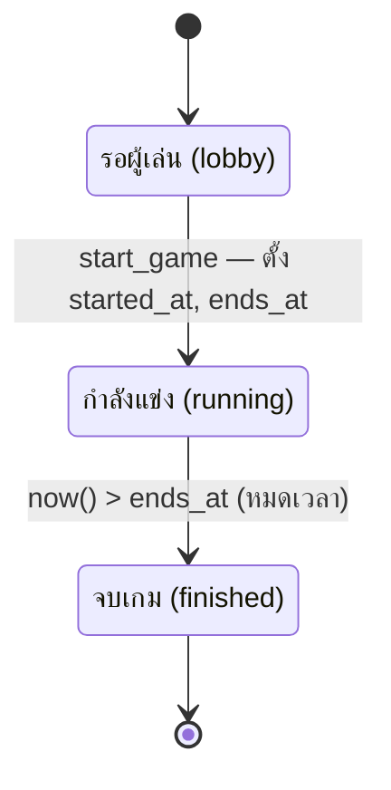
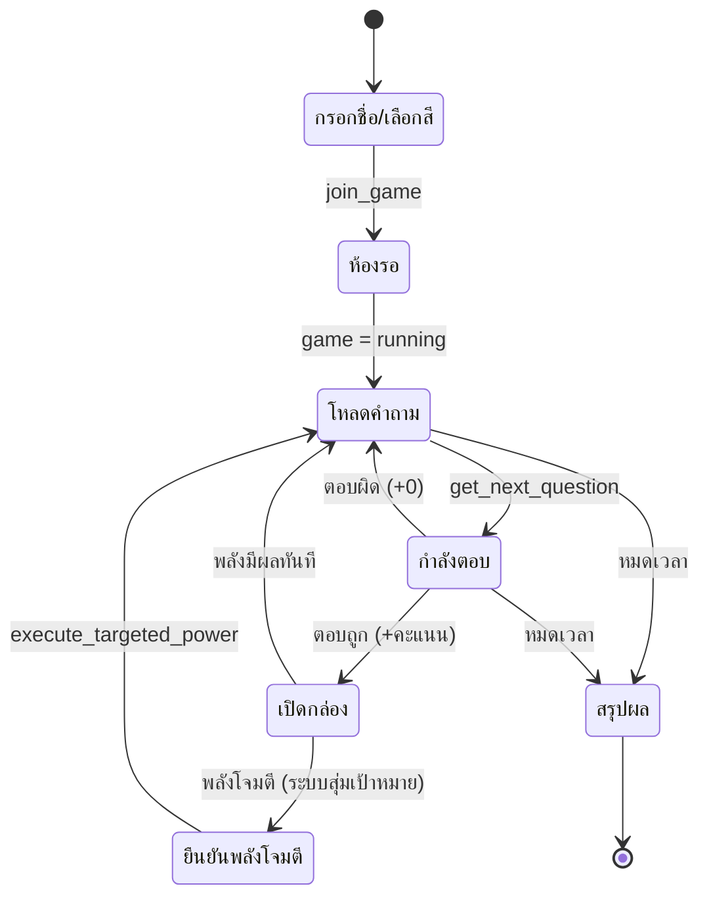
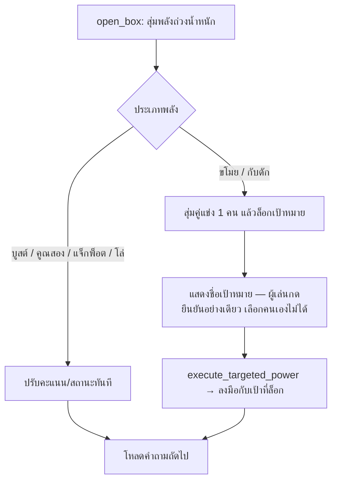

# Quiz Rush — Design Spec

> สรุปแบบเต็มสำหรับทำต่อใน Claude Code
> ใช้คู่กับ `CLAUDE.md` (บริบทย่อ) — ไฟล์นี้ลงรายละเอียด state machine + data model + RPC

---

## 1. ภาพรวม

เกมแข่งตอบคำถามในห้องเรียน สไตล์ **Kahoot ผสม Mario Kart**

- นักเรียนสแกน QR เข้าสนาม → ตอบคำถาม 4 ตัวเลือก
- **ตอบถูก** = ได้คะแนน + เปิด 1 ใน 3 กล่อง สุ่มพลัง
- **ตอบผิด** = ไม่เสียคะแนน ไปข้อถัดไปทันที
- **ตำแหน่งอวตารบนสนาม = คะแนน** → พลังที่เพิ่ม/ขโมยคะแนน ทำให้อวตารพุ่ง/แซงให้เห็นสด
- **ชนะด้วยเวลา**: ครูตั้งเวลาเป็นนาที หมดเวลาใครคะแนนสูงสุดชนะ ข้อสอบหมดให้สุ่มวนใหม่
- **Self-paced**: แต่ละคนวิ่งลูปคำถามของตัวเอง ไม่ต้องรอกัน

### สองจอ
| จอ | บทบาท | แสดงอะไร |
|----|-------|----------|
| จอครู (จอใหญ่) | ผู้ชม | สนามแข่ง 3D อวตารทุกคน ความคืบหน้า อันดับ |
| จอนักเรียน (มือถือ) | ผู้เล่น | โจทย์ + 4 ตัวเลือก, หน้าเปิดกล่อง, หน้ายืนยันพลังโจมตี |

---

## 2. State Machines

### 2.1 วงจรชีวิตเกม (`games.status`)



### 2.2 ลูปของผู้เล่นแต่ละคน (self-paced)



### 2.3 การเปิดกล่อง (open_box)



---

## 3. กติกาคะแนน

ตอนตอบถูก (คำนวณฝั่งเซิร์ฟเวอร์ใน `submit_answer`):

```
points = base_points
if speed_bonus_on:
    points += max(0, speed_bonus_max - time_ms/200)   # ตอบไวได้เพิ่ม
points = round(points * multiplier_next)               # พลัง "คูณสอง"
if sabotaged:
    points = round(points / 2)                         # โดน "กับดัก"
```

หลังตอบ: `multiplier_next → 1`, `sabotaged → false` (ใช้แล้วรีเซ็ต)
**ตอบผิด: หักคะแนน `-wrong_penalty` (ดีฟอลต์ 50)** — กันตอบมั่ว · คะแนนรวมไม่ต่ำกว่า 0 (`greatest(0, ...)`)
ค่าเริ่มต้นใน `games.settings`: `base_points=100, speed_bonus_max=50, speed_bonus_on=true, wrong_penalty=50, track_max_score=3000`

---

## 4. พลังในกล่อง (7 อัน)

| code | ชื่อ | ผล | จังหวะ | weight |
|------|------|----|--------|--------|
| boost | เร่งสปีด | +150 คะแนนทันที | instant | 25 |
| double | คูณสอง | ตอบถูกข้อถัดไป ×2 | instant | 22 |
| steal | ขโมยแต้ม | สุ่มคู่แข่ง 1 คน กดขโมย 100 แต้ม | **attack** | 16 |
| shield | โล่ | กันโดนขโมย 1 ครั้ง | instant | 16 |
| reflect | โล่สะท้อน | โดนขโมย/กับดัก แล้วเด้งกลับใส่คนโจมตี 1 ครั้ง | instant | 12 |
| jackpot | แจ็กพ็อต | สุ่ม +50 ถึง +400 | instant | 11 |
| sabotage | กับดัก | สุ่มคู่แข่ง 1 คน ตอบถูกครั้งหน้าได้ครึ่ง | **attack** | 10 |

- **attack** = ระบบสุ่มเป้าหมายให้ ล็อกไว้ ผู้เล่นกดยืนยันเท่านั้น (กันรุมแกล้งเจาะจง)
- **โล่** กันการขโมยได้ 1 ครั้ง (ใช้แล้วหมด) — กันได้เฉพาะขโมย
- **โล่สะท้อน** เด้งทั้งขโมย+กับดักกลับใส่คนโจมตี 1 ครั้ง (ขโมย→เป้าขโมยกลับ, กับดัก→คนโจมตีโดนเอง) · เช็กก่อนโล่ธรรมดา
- **ตอนตอบถูก** ผู้เล่นเลือกกด 1 ใน 3 กล่องเองได้ แต่พลังข้างในสุ่มฝั่งเซิร์ฟเวอร์ (เดา/โกงไม่ได้)

---

## 5. Data Model (Supabase / Postgres)

| ตาราง | คอลัมน์สำคัญ |
|-------|--------------|
| games | room_code, status(enum lobby/running/finished), duration_min, started_at, ends_at, settings(jsonb มี track_max_score) |
| questions | game_id, **qtype**('mc'/'tf'), body, image_url, choices(jsonb), **correct_index** |
| players | game_id, nickname, avatar_color, score, multiplier_next, shield, **reflect**, sabotaged, pending_power, pending_target |
| answers | player_id, question_id, selected_index, is_correct, points_awarded, time_taken_ms |
| powerups | code, name_th, effect_type, effect_val, weight (แคตตาล็อก + seed 6 อัน) |
| player_powerups | player_id, powerup_id, source_answer_id (log การเปิดกล่อง) |
| **question_sets** | id, title, description, created_at (ชุดข้อสอบในคลังกลาง) |
| **bank_questions** | set_id, qtype('mc'/'tf'), body, image_url, choices(jsonb), correct_index (ข้อสอบในคลัง ใช้ซ้ำได้) |

- `qtype` = `'mc'` (ปรนัย 4 ตัวเลือก) หรือ `'tf'` (ถูก/ผิด, choices=[ถูก,ผิด], correct_index 0=ถูก 1=ผิด)
- คลังกลาง (`question_sets` + `bank_questions`) แยกจากข้อสอบในเกม → `copy_set_to_game` คัดลอกเข้า `questions` ตอนสร้างห้อง

**RLS**: เปิด SELECT สาธารณะเฉพาะ `games`, `players`, `powerups` (ให้จอครู/นักเรียนอ่านสนาม)
`questions` / `answers` / `player_powerups` / `bank_questions` ไม่มี policy → เข้าถึงผ่าน RPC เท่านั้น (กันเฉลยหลุด)
**Realtime**: เปิด publication ให้ `players`, `games`

---

## 6. RPCs (security definer)

**เกม / การเล่น**

| ฟังก์ชัน | อินพุต | คืนค่า |
|----------|--------|--------|
| create_game | duration_min, track_max(=3000) | games |
| start_game | game_id | games — ตั้ง started_at, ends_at |
| end_game | game_id | games — ปิดเกมเป็น finished |
| join_game | room_code, nickname, color | players |
| get_next_question | player_id | คำถาม (ไม่มี correct_index) — วนข้อที่ตอบน้อยสุดก่อน |
| submit_answer | player_id, question_id, selected, time_ms | {is_correct, points, box_offered} |
| open_box | player_id, source_answer_id | {kind: instant/attack, ...} + target ถ้าเป็น attack |
| execute_targeted_power | player_id | {kind, gain, message, new_score} |

**คลังข้อสอบ (Admin)**

| ฟังก์ชัน | อินพุต | คืนค่า / ผล |
|----------|--------|--------|
| create_question_set | title, description | question_set ใหม่ |
| rename_question_set | set_id, title | เปลี่ยนชื่อชุด |
| delete_question_set | set_id | ลบชุด (cascade ลบข้อในชุด) |
| add_bank_question | set_id, qtype, body, choices, correct_index (+image_url) | เพิ่มข้อทีละข้อ |
| update_bank_question | id, qtype, body, choices, correct_index (+image_url) | แก้ไขข้อ |
| delete_bank_question | id | ลบข้อ |
| import_bank_questions | set_id, items(jsonb) | นำเข้าหลายข้อ (CSV) |
| copy_set_to_game | set_id, game_id | คัดลอกทั้งชุดเข้า `questions` ของห้อง (รองรับ image_url) |

---

## 7. กฎสำคัญ (ห้ามพลาด)

1. **เฉลยห้ามหลุดไป client** — `correct_index` เข้าถึงผ่าน RPC เท่านั้น ตรวจคำตอบฝั่งเซิร์ฟเวอร์เสมอ
2. **พลังโจมตีสุ่มเป้าหมาย เลือกคนเองไม่ได้** — ใช้ `pending_power` / `pending_target` ล็อกเป้า
3. ห้าม commit `.env`

---

## 8. Tech Stack & Deploy

- React (Vite) + Supabase (Postgres + Realtime) + Netlify
- จอนักเรียน: React UI เบา · จอครู: React Three Fiber (ขั้น ค)
- Deploy: `npm run build` → ลาก `dist/` ขึ้น Netlify · ตั้ง env `VITE_SUPABASE_URL`, `VITE_SUPABASE_ANON_KEY`
- SQL: รันใน Supabase SQL Editor ตามลำดับเลขไฟล์ใน `db/`

---

## 9. สถานะงาน

- [x] **(ก) Lobby + สแกน QR** — ครูสร้างห้อง/ตั้งเวลา/QR/รายชื่อสด/เริ่มเกม · นักเรียนเข้าร่วม/ห้องรอ
- [x] **(ข) เครื่องยนต์ควิซบนมือถือ**
  - หน้าตอบคำถาม (get_next_question → submit_answer)
  - หน้าเปิด 1 ใน 3 กล่อง (open_box) + หน้ายืนยันพลังโจมตี (execute_targeted_power)
  - แถบเวลานับถอยหลัง (อิง games.ends_at) → เด้งหน้าสรุปเมื่อหมดเวลา
  - seed คำถามผ่าน `db/03_seed_questions.sql` + auto-seed ตอนสร้างห้อง
- [x] **(ค) สนามแข่ง 3D บนจอครู** (`src/components/RaceField.jsx`)
  - R3F อวตาร low-poly วิ่งตามคะแนนสด · **ต้องใช้ R3F v8 + drei v9** (v9/v10 ต้องการ React 19) · lazy-load ไม่กระทบ bundle นักเรียน
  - **สนามวงรอบ (วงรี)** ทุกคนวิ่งแทร็กเดียวกัน แซงกันได้: คะแนน → มุมรอบวง (`track_max_score / LAPS_AT_MAX`), กระจายเลนตามรัศมี, วนไม่จำกัด
  - อวตารน่ารัก (ตา/หมวก/แขนขาแกว่ง) หันตามทิศโค้ง, เอียงตอนพุ่ง + ฝุ่น, ผู้นำได้มงกุฎ + ประกาย
  - interpolate ด้วย lerp, throttle realtime 0.7s · ฟอนต์ไทย `public/fonts/Sarabun-Bold.ttf` สำหรับป้ายชื่อ `<Text>`
  - ปรับค่าคงที่หัวไฟล์ได้: `RX, RZ, ROAD_W, LAPS_AT_MAX, LERP_SPEED`
- [x] **(ง) หน้า Admin คลังข้อสอบ** (`/admin`, `src/pages/Admin.jsx`)
  - คลังกลางใช้ซ้ำได้ จัดเป็น "ชุด" (question_sets) → ตอนสร้างห้องเลือกชุด → `copy_set_to_game` คัดลอกเข้าห้อง
  - เพิ่มข้อทีละข้อ (ปรนัย/ถูกผิด) + นำเข้า CSV (มี template + parser ที่ `src/lib/csv.js`)
  - แก้ไขข้อสอบ/เปลี่ยนชื่อชุด/รูปภาพในโจทย์ (image_url) · gate ด้วย `VITE_ADMIN_PASSWORD` (client-side gate)
- [x] **จบเกม + ประกาศผล** — end_game + โพเดียมบนจอครู · leaderboard สด Top 10 · toast + เสียง/สั่น (`src/lib/sfx.js`) แจ้งเตือนเมื่อโดนพลังโจมตี

---

## 10. โครงไฟล์ปัจจุบัน

```
quiz-rush/
├─ CLAUDE.md              บริบทย่อ (Claude Code อ่านอัตโนมัติ)
├─ DESIGN.md              ไฟล์นี้
├─ db/                    รันตามลำดับเลขใน Supabase SQL Editor
│  ├─ 01_schema_v0.sql    ตาราง + RLS + seed พลัง + RPC หลัก
│  ├─ 02_lobby_rpcs.sql   create_game + start_game
│  ├─ 03_seed_questions.sql   seed คำถามตัวอย่าง
│  ├─ 04_question_bank.sql    question_sets + bank_questions + RPC คลังข้อสอบ
│  ├─ 05_end_game.sql     end_game RPC
│  ├─ 06_admin_extras.sql แก้ไขข้อสอบ/ชุด + image_url
│  └─ 07_penalty_reflect.sql   หักคะแนนตอบผิด + พลังโล่สะท้อน
├─ public/
│  ├─ _redirects          SPA fallback (Netlify)
│  └─ fonts/Sarabun-Bold.ttf   ฟอนต์ไทยสำหรับป้ายชื่อในสนาม 3D
└─ src/
   ├─ lib/                supabase.js, api.js, constants.js, csv.js, sfx.js
   ├─ components/         Pieces.jsx (PlayerChip, ColorPicker), RaceField.jsx (สนาม 3D)
   └─ pages/              Home, HostLobby, JoinPage, PlayerLobby, Playing, Admin
```
